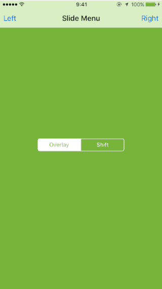

# SlideMenu

View controller container which provides the sliding menus.

## Requirements

- iOS 8.0 or later

## Usage

    let slideMenuController = SlideMenuController(
        mainViewController: ...,
        leftViewController: ...,
        rightViewController: ...
    )

    window?.rootViewController = slideMenuController

## Notes

- Device rotation is not supported for `SlideMenuTransitionStyle.Shift` style.

## License

SlideMenu is released under the MIT license.  
For more information, see LICENSE file in this repository.
